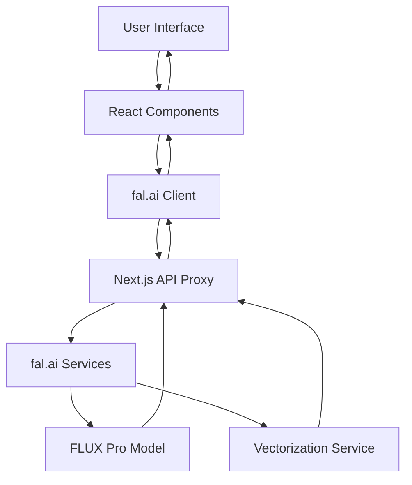

# Design Document

## Overview

The image generation application is a Next.js React application that provides a clean, three-column interface for text-to-image generation and image-to-SVG conversion using fal.ai APIs. The application leverages the existing fal.ai proxy setup and shadcn/ui components for a consistent, professional user experience.

## Architecture

### High-Level Architecture



### Component Architecture

The application follows a component-based architecture with clear separation of concerns:

- **Page Component**: Main container managing overall state and layout
- **Prompt Input Component**: Handles text input and generation trigger
- **Image Display Component**: Shows generated images and loading states
- **SVG Conversion Component**: Manages SVG conversion and display
- **Loading/Error Components**: Reusable UI feedback components

## Components and Interfaces

### Core Components

#### 1. ImageGenerationApp (Main Page Component)
- **Purpose**: Root component managing application state and layout
- **State Management**: 
  - `prompt`: Current text prompt
  - `generatedImage`: Generated image data and URL
  - `svgResult`: Converted SVG data
  - `isGenerating`: Loading state for image generation
  - `isConverting`: Loading state for SVG conversion
  - `errors`: Error states for both operations

#### 2. PromptInput Component
- **Purpose**: Text input area with generation button
- **Props**: 
  - `prompt`: string
  - `onPromptChange`: (prompt: string) => void
  - `onGenerate`: () => void
  - `isGenerating`: boolean
- **Features**: 
  - Textarea for prompt input
  - Generate button with loading state
  - Input validation

#### 3. ImageDisplay Component
- **Purpose**: Display generated images with metadata
- **Props**:
  - `imageData`: GeneratedImage | null
  - `isLoading`: boolean
  - `error`: string | null
- **Features**:
  - Image preview with proper aspect ratio
  - Loading skeleton
  - Error state display
  - Download image button

#### 4. SVGConverter Component
- **Purpose**: SVG conversion interface and display
- **Props**:
  - `imageUrl`: string | null
  - `svgResult`: SVGResult | null
  - `onConvert`: () => void
  - `isConverting`: boolean
  - `error`: string | null
- **Features**:
  - Convert button (disabled when no image)
  - SVG preview/download
  - Loading and error states
  - Download SVG button

### API Integration Layer

#### fal.ai Client Configuration
```typescript
import { fal } from "@fal-ai/client";

fal.config({
  proxyUrl: "/api/fal/proxy",
});
```

#### Image Generation Service
```typescript
interface ImageGenerationParams {
  prompt: string;
  guidance_scale?: number;
  num_images?: number;
  output_format?: string;
  aspect_ratio?: string;
}

interface GeneratedImage {
  url: string;
  width: number;
  height: number;
  content_type: string;
}
```

#### SVG Conversion Service
```typescript
interface SVGConversionParams {
  image_url: string;
}

interface SVGResult {
  url: string;
  content_type: string;
}
```

## Data Models

### Application State Model
```typescript
interface AppState {
  prompt: string;
  generatedImage: GeneratedImage | null;
  svgResult: SVGResult | null;
  isGenerating: boolean;
  isConverting: boolean;
  generationError: string | null;
  conversionError: string | null;
  generationLogs: string[];
  conversionLogs: string[];
}
```

### API Response Models
```typescript
interface FalResponse<T> {
  data: T;
  requestId: string;
}

interface QueueUpdate {
  status: 'IN_QUEUE' | 'IN_PROGRESS' | 'COMPLETED' | 'FAILED';
  logs: Array<{ message: string; level: string; timestamp: string }>;
}
```

## Error Handling

### Error Categories
1. **Network Errors**: API connectivity issues
2. **Validation Errors**: Invalid input parameters
3. **Service Errors**: fal.ai service failures


### Error Handling Strategy
- **User-Friendly Messages**: Convert technical errors to readable messages
- **Graceful Degradation**: Maintain app functionality when possible
- **Error Boundaries**: React error boundaries for component-level error handling

### Error Display
```typescript
interface ErrorState {
  type: 'network' | 'validation' | 'service' | 'rate_limit';
  message: string;
  retryable: boolean;
}
```

## UI/UX Design

### Layout Structure
```
┌─────────────────────────────────────────────────────────────┐
│                    Page Title                               │
│              "From Text to Image and Image to SVG"         │
├─────────────────┬─────────────────┬─────────────────────────┤
│                 │                 │                         │
│   Prompt Input  │  Generated      │    SVG Conversion       │
│                 │  Image Display  │                         │
│   - Textarea    │  - Image        │  - Convert Button       │
│   - Generate    │  - Loading      │  - SVG Preview          │
│     Button      │  - Error        │  - Download Button      │
│                 │                 │                         │
└─────────────────┴─────────────────┴─────────────────────────┘
```

### Responsive Design
- **Desktop**: Three-column layout as specified
- **Tablet**: Stacked layout with maintained proportions
- **Mobile**: Single-column vertical stack

### Visual Feedback
- **Loading States**: Skeleton loaders and spinners
- **Progress Indicators**: Real-time log display during processing
- **Success States**: Clear visual confirmation of completed operations
- **Error States**: Prominent but non-intrusive error messages

